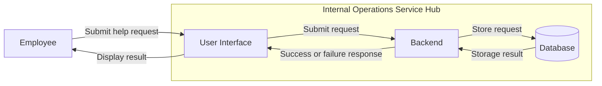

# Internal Operations Service Hub - Architecture

## Requirement

Employees can submit help requests to the appropriate department.

## Actors

- Employees
- Department staff

## Responsibilities

- Employees submit help requests.
- The system receives the requests.
- The system sends or assigns each request to the appropriate department.
- The system stores the request.
- The system informs the employee whether the request was submitted successfully or failed.

## Components

### User Interface

The UI is how employees interact with the system and submit requests.

### Backend

The backend receives requests, handles the logic, checks department information, verifies authorization, and stores requests.

### Database

The database stores requests and department-related data.

## System Boundary

Outside the system:

- Employees
- Department staff

Inside the system:

- User Interface
- Backend
- Database

## Architecture Diagram

## Main Flow

1. The employee submits a help request through the UI.
2. The UI sends the request to the backend.
3. The backend checks the department information and verifies authorization.
4. The backend stores the request in the database.
5. The database confirms whether the request was stored successfully.
6. The backend sends the result back to the UI.
7. The UI shows the result to the employee.

## Communication

The communication between the UI and backend is synchronous when submitting a request.

The employee needs to wait for a response to know whether the request was submitted successfully or whether something went wrong.

If a request needs approval, that approval can happen later and does not need to block the initial submission.

## Trust and Authorization

The backend should not trust identity or permission information provided only by the UI.

The backend should verify that the employee is allowed to perform the action before processing the request.

## Failure Handling

If the database is unavailable, the request should not be accepted because the system cannot safely store it.

The employee should see an error message explaining that the request could not be submitted and should be tried again later.

The system does not need to save the request somewhere else or retry automatically because this is not required yet.

## Scalability

There is not enough information yet about how many employees will use the system or how many requests may occur at the same time.

Because of that, the architecture remains simple for now.

More scaling decisions can be made later if those requirements become clear.

## Architecture Decisions

### Request Submission

Problem: The employee needs to know whether the request was submitted.

Options:

- Synchronous communication
- Asynchronous communication

Decision: Use synchronous communication.

Reason: The employee needs an immediate success or failure response.

Consequence: The employee has to wait for the backend to respond.

### Authorization

Problem: Information sent from the UI should not automatically be trusted.

Options:

- Let the UI control permissions.
- Let the backend verify permissions.

Decision: The backend verifies permissions.

Reason: This prevents users from bypassing access rules through the UI.

Consequence: The backend must check authorization before processing requests.