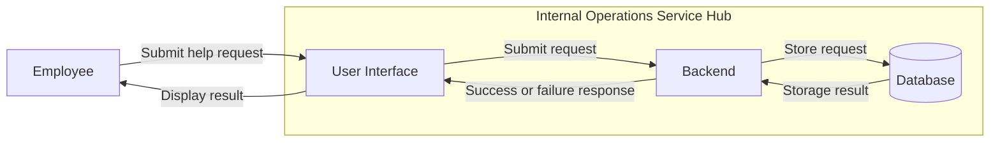
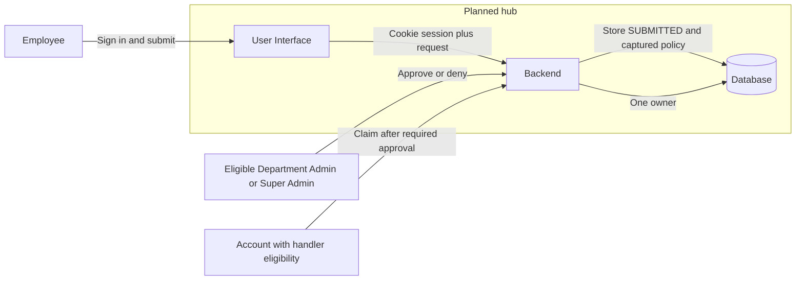

# Internal Operations Service Hub - Architecture

The sections from Requirement through Architecture Decisions are the Week 1 architecture record. The repository now runs the Week 4 React UI, NestJS API, PostgreSQL, advisory intake, email/password sessions, company signup, and the company Super Admin workspace, including a company-wide Requests list. Eligible handlers claim unassigned requests in their department. Super Admin may submit and cannot own or handle. Every protected query is limited to the caller’s company.

**Implemented today:** Super Admin dashboard totals and `GET /admin/requests` are company-scoped. The request list returns ID, submitter name, title, submitter department, destination department, status, and whether the row is the Super Admin’s own submission. It does not return description or approval state. `GET /requests/:id` and history are full detail for that Super Admin’s submissions and for captured `SUPER_ADMIN` requests they did not submit. Unrelated same-company ids are **403**. Another company’s id is **404**.

**Implemented (26 September 2026):** Eligible handlers use Requests tabs Available, Claimed by Me, and Completed. My Requests is submissions. Department Admins also see department-policy requests and Approvals. Super Admin manages the company’s departments and request types on Departments. A Department Admin can rename only their own department from Settings > My Department. Request-type configuration stays Super Admin-only. Settings is Profile, Security, and Notifications, plus Company for Super Admin and My Department for Department Admin. Do not restore company-wide body access. Remaining decisions are listed in `docs/product-spec.md` and ADR-004.

## Requirement

Employees can submit help requests to the appropriate department.

## Actors

- Employees
- Department staff

## Responsibilities

- Employees submit help requests.
- The system receives the requests.
- The system sends or assigns each request to the appropriate department.
- The system stores the request.
- The system informs the employee whether the request was submitted successfully or failed.

## Components

### User Interface

The UI is how employees interact with the system and submit requests.

### Backend

The backend receives requests, handles the logic, checks department information, verifies authorization, and stores requests.

### Database

The database stores requests and department-related data.

## System Boundary

Outside the system:

- Employees
- Department staff

Inside the system:

- User Interface
- Backend
- Database

## Architecture Diagram

```mermaid
flowchart LR
    Employee[Employee]

    subgraph Hub[Internal Operations Service Hub]
        UI[User Interface]
        Backend[Backend]
        DB[(Database)]

        UI -->|Submit request| Backend
        Backend -->|Store request| DB
        DB -->|Storage result| Backend
        Backend -->|Success or failure response| UI
    end

    Employee -->|Submit help request| UI
    UI -->|Display result| Employee
```

## Main Flow

1. The employee submits a help request through the UI.
2. The UI sends the request to the backend.
3. The backend checks the department information and verifies authorization.
4. The backend stores the request in the database.
5. The database confirms whether the request was stored successfully.
6. The backend sends the result back to the UI.
7. The UI shows the result to the employee.

## Communication

The communication between the UI and backend is synchronous when submitting a request.

The employee needs to wait for a response to know whether the request was submitted successfully or whether something went wrong.

If a request needs approval, that approval can happen later and does not need to block the initial submission.

## Trust and Authorization

The backend should not trust identity or permission information provided only by the UI.

The backend should verify that the employee is allowed to perform the action before processing the request.

## Failure Handling

If the database is unavailable, the request should not be accepted because the system cannot safely store it.

The employee should see an error message explaining that the request could not be submitted and should be tried again later.

The system does not need to save the request somewhere else or retry automatically because this is not required yet.

## Scalability

There is not enough information yet about how many employees will use the system or how many requests may occur at the same time.

Because of that, the architecture remains simple for now.

More scaling decisions can be made later if those requirements become clear.

## Architecture Decisions

### Request Submission

Problem: The employee needs to know whether the request was submitted.

Options:

- Synchronous communication
- Asynchronous communication

Decision: Use synchronous communication.

Reason: The employee needs an immediate success or failure response.

Consequence: The employee has to wait for the backend to respond.

### Authorization

Problem: Information sent from the UI should not automatically be trusted.

Options:

- Let the UI control permissions.
- Let the backend verify permissions.

Decision: The backend verifies permissions.

Reason: This prevents users from bypassing access rules through the UI.

Consequence: The backend must check authorization before processing requests.

## Proposed full-product changes

Confirmed product rules are in `docs/product-spec.md`. Release and reassignment are still open. Password reset, visibility, and Settings are recorded in `docs/decisions/ADR-004-workflow-and-recovery.md`. Password reset is implemented. Email/password sessions from `docs/decisions/ADR-002-authentication.md` are implemented. Company signup and company-scoped access from `docs/decisions/ADR-003-company-signup.md` are implemented. The Super Admin workspace (dashboard counts, employee list, departments, and the company request list) is implemented for that company.

**Implemented today:** Super Admin may submit. They cannot own, claim, or change work status. Eligible handlers claim with `POST /requests/:id/claim`. `PATCH /requests/:id/owner` is blocked. Claim and transition are rejected while approval is pending or denied. Unclaimed on the Super Admin request list is not a claim button. Limited Super Admin oversight is implemented. Detail and history are own submissions plus captured `SUPER_ADMIN` requests that Super Admin did not submit. Approval state, inboxes, and decisions are implemented and do not change work status. New companies start from the founder’s confirmed departments. The wizard defaults are ordinary IT, HR, and Finance departments with their catalog request types; Super Admin may rename them or delete unused ones. A signup that omits the list still creates those three with no types. Existing companies are not backfilled. Super Admin manages request types per destination department. New requests require a valid type and store a snapshot of that type’s `approvalPolicy`. Later type edits do not rewrite submitted requests. Optional templates (IT, HR, Finance, Operations, Marketing, Facilities, Custom/Empty) keep display name independent of the template; Super Admin reviews suggested types/policies and applies only the confirmed list. The catalog in `docs/product-spec.md` is a recommendation, not company policy. Signup does not apply types.

**Implemented (26 September 2026 role views):** Eligible handlers use Requests tabs Available, Claimed by Me, and Completed. Available is only work they can claim now. Claiming moves it to Claimed by Me. The owner starts work and completes through the existing transitions. My Requests is always the signed-in person’s submissions. Department Admins see a department dashboard, a department-wide All requests list, and Approvals for requests others submitted that they can decide. Handler tabs appear for every Department Admin and for an employee with handler eligibility. Employees see their dashboard, My Requests, and Settings for Profile, Security, and Notifications. An employee who can handle work is shown as Handler. Sidebar order for every role is Dashboard, Requests, My Requests, Approvals, Staff, Departments, Settings, omitting pages that role cannot open. A new login opens Dashboard. Dashboard cards for Requests, Approvals, Staff, Departments, and My Requests, including which counts overlap and which are linked, are in ADR-004. Staff is the people total and shares one full-width panel with a compact Departments count. My Requests and Approvals use the Requests table styling. Shared columns are ID, Title, Submitter, Employee Department, Destination Department, and Submitted At, shown only when that list returns them. The last column is Work Status, Request Stage, or Approval Status. Rows share one height, titles stay within two lines, and the authorized detail overlay shows the full title and description. Opening a request from My Requests, a handler queue, or an approval list shows its details in a centered overlay. Super Admin Departments is the company overview and the department and request-type editor. Load Request by ID is no longer in the UI; lists search by exact ID. New Request and AI Intake are buttons on the dashboard and My Requests. Each navigates to My Requests and opens that form in a centered overlay over a dimmed page. They are not sidebar items. Super Admin My Requests is a separate sidebar page for that account’s submissions. Requests stays the limited company oversight list and has no All requests / My requests switch. Department Admins see a department dashboard (members, destination-department totals, unclaimed, claimed, and eligible approvals), Staff in that department, All requests for that destination, and the approval list. Handler tabs appear for every Department Admin and for an employee with handler eligibility. Super Admin Settings is Profile, Security, Notifications, and Company. A Department Admin renames only their own department from Settings > My Department and can view that department’s request types. AI never sets company policy. Do not restore company-wide Super Admin body access. `GET /requests/:id` and history match those lists: own submission, work the eligible handler owns or can claim now, or a request that Department Admin or Super Admin can decide. Already-owned legacy work stays visible to that handler. Unrelated same-company ids are **403**.

### Identity

Email and password authentication replaces `X-Actor-Id`. There is no public employee signup. A founder creates a company workspace and verifies their email before that company and its first Super Admin are active. That Super Admin invites staff in the same company, and invitees set their own passwords. The retired first-Super-Admin command does not create an account. The backend checks the session, requires the session account and company to match the token subject and the account row, and loads role and handler eligibility from the database. Queries for requests, history, employees, departments, intake departments, and Super Admin dashboard, employee-list, and request-list routes include the caller’s company, so another company’s ids do not reveal or change that data. Super Admin dashboard, employee-list, and request-list endpoints also require the Super Admin role. An Employee or Department Admin caller is denied even if they know the URL.

They may submit requests. They cannot become current owner and cannot assign, claim, or transition, even if `canHandle` is true. Claim and transition require handler access: an employee with handler eligibility, or a Department Admin in their own department. Super Admin is never eligible. Both are rejected while approval is pending or denied. **Implemented today:** a company Super Admin sees the limited oversight table and receives description/history for requests they submitted and for captured `SUPER_ADMIN` requests they are eligible to decide. Unrelated same-company detail is **403**. Company-wide Super Admin body access is not restored.

Absolute expiry is 8 hours. Idle expiry is 30 minutes. Sessions are revocable. Login throttling counts in-flight attempts against the same email and IP failure limits. A failed activity timestamp does not change the response of a change that already committed. The UI clears the previous account's request, history, intake, form, lookup, and CSRF state on logout, on a protected **401**, and when another account signs in, and it drops late responses from the previous session. Production email delivery and deployment hosting are still open. Until a mail provider is chosen, production signup, invitations, and password reset fail and create no records. A successful reset revokes that account’s open sessions. The link expires after one hour and cannot be reused. The Week 1 rule stands: the backend does not trust identity or permissions sent only by the UI.

Deactivation immediately blocks login and authenticated actions, keeps history, and blocks new claims. Staff Remove sets `active` false, revokes open sessions, and retires unused invitations. It is rejected while the account owns unfinished work, while it is the caller’s own account, or while it is the last active Super Admin.

### Actors

Planned roles are Employee, Department Admin, and Super Admin. Each account has one role. Handler eligibility is a separate permission. The Week 1 "department staff" actor is covered by those roles for new work. The current `canHandle` flag is the temporary stand-in for handler eligibility.

### Ownership

Eligible handlers claim an unassigned request in their department with `POST /requests/:id/claim` when approval is `NOT_REQUIRED` or `APPROVED`, or when the approval state is null and the captured policy is null or `NONE`. That null state is left unchanged. A null state with a required captured policy waits for approval and cannot be claimed or transitioned. The claim sets the owner and leaves work status `SUBMITTED`. `PATCH /requests/:id/owner` no longer assigns an owner. Super Admin cannot be the owner and cannot claim, even if `canHandle` is true. The claim rejects the submitter, another department, another company, pending approval, and denial. Concurrent claims use one conditional update and leave exactly one owner. Only that owner can transition. Department Admins can claim in their department by role, without a separate handler flag. Available, Claimed by Me, and Completed are tabs on Requests, not a separate page. A request whose captured policy is not `NONE` is claimable only after approval. Denial never unlocks claiming. Super Admin may approve or deny when the captured policy makes them eligible. Approval shipped before self-claim so claim tests enforce approval-before-claim.

### Approval

ADR-001 still holds: submission stays synchronous, and approval does not block storing the request. Each department request type uses `NONE`, `DEPARTMENT_ADMIN`, or `SUPER_ADMIN`. That captured policy is stored on the request at create. When the captured policy is not `NONE`, the request stays out of the claimable queue until the eligible approver decides: destination Department Admin for `DEPARTMENT_ADMIN`, or a Super Admin who did not submit it for `SUPER_ADMIN`. The submitter still sees it. Authorized approvers see it in the approval inbox. Super Admin sees it on the limited oversight table; they receive description and history for it only when they submitted it or are the eligible approver. Denial stores a reason, leaves work status unchanged, and sets approval state to Denied. That request cannot be claimed. Resubmission creates a new request and keeps the original decision. Approval state stays off the work-status field. Work status remains `SUBMITTED → IN_PROGRESS → COMPLETED`. The submitter cannot decide their own request. Self-approval is never an implicit fallback, including when the only Super Admin submitted a `SUPER_ADMIN` request; that case is unresolved in `docs/product-spec.md`. AI never chooses the policy.

### Departments and templates

**Implemented today:** Signup persists the founder’s confirmed departments and request types. The wizard defaults are IT, HR, and Finance with their catalog types. A signup that omits the list still creates those three with no types. Super Admin may add a department with a free-text name, optionally from a template after reviewing suggested types, rename any department, and delete one that has no employees and no requests (**409** otherwise). A Department Admin may rename only their own department. Request-type configuration stays Super Admin-only. Existing companies are not backfilled. Super Admin creates, renames, and edits request types for each destination department, including `NONE` | `DEPARTMENT_ADMIN` | `SUPER_ADMIN`. New requests require a type from that department and store a snapshot of its policy. Later type edits do not change submitted requests. Optional templates are IT, HR, Finance, Operations, Marketing, Facilities, and Custom/Empty. Display name is independent of the template. Super Admin reviews suggested types and policies, may edit or remove them, and applies only the confirmed list. Custom/Empty suggests none. The catalog in `docs/product-spec.md` is a recommendation. Signup does not apply types. Super Admin may apply a selected template to any existing department. The product never infers a template from a department name.

**Implemented today:** Super Admin Departments is the overview and where that role manages the company’s department structure, templates, and request types. A Department Admin renames only their own department from Settings > My Department. Settings is otherwise the account page. Approval decisions that use the captured snapshot are implemented. Top-handler ranking and company-details fields are not built.

### Proposed claim flow

```mermaid
flowchart LR
    Employee[Employee]
    Handler[Account with handler eligibility]
    Approver[Eligible Department Admin or Super Admin]

    subgraph Hub[Planned hub]
        UI[User Interface]
        API[Backend]
        DB[(Database)]
    end

    Employee -->|Sign in and submit| UI
    UI -->|Cookie session plus request| API
    API -->|Store SUBMITTED and captured policy| DB
    Approver -->|Approve or deny| API
    Handler -->|Claim after required approval| API
    API -->|One owner| DB
```

The Week 1 submission diagram above remains the record of the original synchronous submit path. Approval is decided before claiming. Cookie sessions replace the Week 1-era JWT-in-the-diagram wording; identity stays the ADR-002 session.