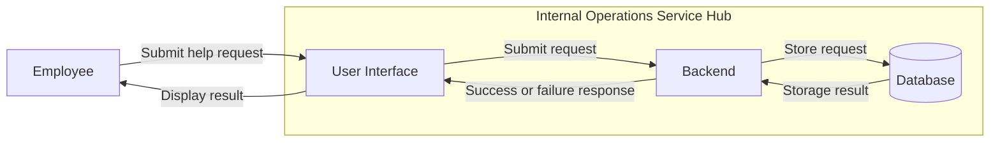
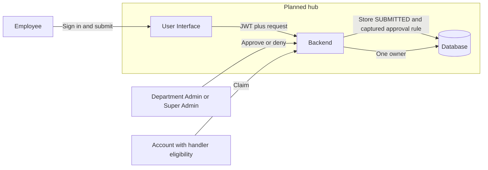

# Internal Operations Service Hub - Architecture

The sections from Requirement through Architecture Decisions are the Week 1 architecture record. The repository now runs the Week 4 React UI, NestJS API, PostgreSQL, advisory intake, email/password sessions, and company signup. Manual owner assignment and `canHandle` remain the temporary request rules, and every protected query is limited to the caller’s company. Confirmed later changes are in [Proposed full-product changes](#proposed-full-product-changes). Claiming, approvals, and admin screens are not implemented. Remaining decisions are listed in `docs/product-spec.md`.

## Requirement

Employees can submit help requests to the appropriate department.

## Actors

- Employees
- Department staff

## Responsibilities

- Employees submit help requests.
- The system receives the requests.
- The system sends or assigns each request to the appropriate department.
- The system stores the request.
- The system informs the employee whether the request was submitted successfully or failed.

## Components

### User Interface

The UI is how employees interact with the system and submit requests.

### Backend

The backend receives requests, handles the logic, checks department information, verifies authorization, and stores requests.

### Database

The database stores requests and department-related data.

## System Boundary

Outside the system:

- Employees
- Department staff

Inside the system:

- User Interface
- Backend
- Database

## Architecture Diagram

```mermaid
flowchart LR
    Employee[Employee]

    subgraph Hub[Internal Operations Service Hub]
        UI[User Interface]
        Backend[Backend]
        DB[(Database)]

        UI -->|Submit request| Backend
        Backend -->|Store request| DB
        DB -->|Storage result| Backend
        Backend -->|Success or failure response| UI
    end

    Employee -->|Submit help request| UI
    UI -->|Display result| Employee
```

## Main Flow

1. The employee submits a help request through the UI.
2. The UI sends the request to the backend.
3. The backend checks the department information and verifies authorization.
4. The backend stores the request in the database.
5. The database confirms whether the request was stored successfully.
6. The backend sends the result back to the UI.
7. The UI shows the result to the employee.

## Communication

The communication between the UI and backend is synchronous when submitting a request.

The employee needs to wait for a response to know whether the request was submitted successfully or whether something went wrong.

If a request needs approval, that approval can happen later and does not need to block the initial submission.

## Trust and Authorization

The backend should not trust identity or permission information provided only by the UI.

The backend should verify that the employee is allowed to perform the action before processing the request.

## Failure Handling

If the database is unavailable, the request should not be accepted because the system cannot safely store it.

The employee should see an error message explaining that the request could not be submitted and should be tried again later.

The system does not need to save the request somewhere else or retry automatically because this is not required yet.

## Scalability

There is not enough information yet about how many employees will use the system or how many requests may occur at the same time.

Because of that, the architecture remains simple for now.

More scaling decisions can be made later if those requirements become clear.

## Architecture Decisions

### Request Submission

Problem: The employee needs to know whether the request was submitted.

Options:

- Synchronous communication
- Asynchronous communication

Decision: Use synchronous communication.

Reason: The employee needs an immediate success or failure response.

Consequence: The employee has to wait for the backend to respond.

### Authorization

Problem: Information sent from the UI should not automatically be trusted.

Options:

- Let the UI control permissions.
- Let the backend verify permissions.

Decision: The backend verifies permissions.

Reason: This prevents users from bypassing access rules through the UI.

Consequence: The backend must check authorization before processing requests.

## Proposed full-product changes

Confirmed product rules are in `docs/product-spec.md`. Release, reassignment, and password reset are still open. Email/password sessions from `docs/decisions/ADR-002-authentication.md` are implemented. Company signup and company-scoped access from `docs/decisions/ADR-003-company-signup.md` are implemented. Claiming, approvals, and admin screens are not.

### Identity

Email and password authentication replaces `X-Actor-Id`. There is no public employee signup. A founder creates a company workspace and verifies their email before that company and its first Super Admin are active. That Super Admin invites staff in the same company, and invitees set their own passwords. The retired first-Super-Admin command does not create an account. The backend checks the session, requires the session account and company to match the token subject and the account row, and loads role and handler eligibility from the database. Queries for requests, history, employees, departments, and intake departments include the caller’s company, so another company’s ids do not reveal or change that data. Absolute expiry is 8 hours. Idle expiry is 30 minutes. Sessions are revocable. Login throttling counts in-flight attempts against the same email and IP failure limits. A failed activity timestamp does not change the response of a change that already committed. The UI clears the previous account's request, history, intake, form, lookup, and CSRF state on logout, on a protected **401**, and when another account signs in, and it drops late responses from the previous session. Password reset, production email delivery, and deployment hosting are still open. Until a mail provider is chosen, production signup and invitations fail and create no records. The Week 1 rule stands: the backend does not trust identity or permissions sent only by the UI.

Deactivation immediately blocks login and authenticated actions, keeps history, and blocks new claims. It is rejected while the account owns a request that is not `COMPLETED`.

### Actors

Planned roles are Employee, Department Admin, and Super Admin. Each account has one role. Handler eligibility is a separate permission. The Week 1 "department staff" actor is covered by those roles for new work. The current `canHandle` flag is the temporary stand-in for handler eligibility.

### Ownership

Week 4 still assigns an owner with `PATCH /requests/:id/owner`. The planned path removes manual admin assignment. The claimable queue holds eligible unassigned requests. Assigned to me is a separate list of requests that person owns. An account with handler eligibility claims from the claimable queue, and only in their department. The claim rejects the submitter. A request that requires approval enters that queue only after approval. Denial never unlocks claiming. Concurrent claims leave exactly one owner. The mechanism that enforces that single owner is an implementation choice for the feature that adds claiming. Department Admins and Super Admins claim only when handler eligibility is explicitly granted.

### Approval

ADR-001 still holds: submission stays synchronous, and approval does not block storing the request. When the requirement captured on that request says approval is required, the request stays out of the claimable queue until a destination Department Admin or Super Admin approves it. The submitter still sees it, authorized approvers see it in the approval inbox, and Super Admin sees it with every other request in that same company. Denial stores a reason, leaves work status unchanged, and sets approval state to Denied. That request cannot be claimed. Resubmission creates a new request and keeps the original decision. Approval state stays off the work-status field. Work status remains `SUBMITTED → IN_PROGRESS → COMPLETED`.

### Proposed claim flow

```mermaid
flowchart LR
    Employee[Employee]
    Handler[Account with handler eligibility]
    Admin[Department Admin or Super Admin]

    subgraph Hub[Planned hub]
        UI[User Interface]
        API[Backend]
        DB[(Database)]
    end

    Employee -->|Sign in and submit| UI
    UI -->|JWT plus request| API
    API -->|Store SUBMITTED and captured approval rule| DB
    Admin -->|Approve or deny| API
    Handler -->|Claim| API
    API -->|One owner| DB
```

The Week 1 submission diagram above remains the record of the original synchronous submit path.