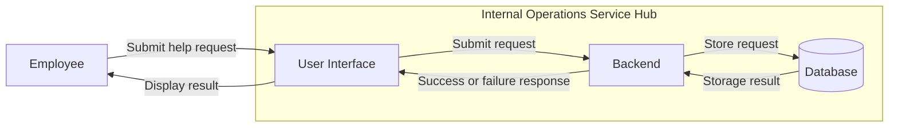
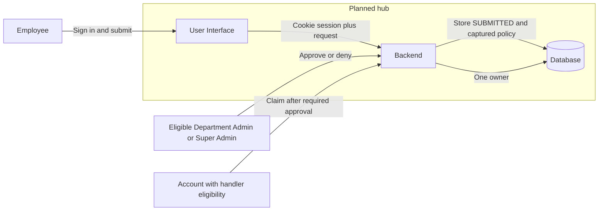

# Internal Operations Service Hub - Architecture

The sections from Requirement through Architecture Decisions are the Week 1 architecture record. The repository now runs the Week 4 React UI, NestJS API, PostgreSQL, advisory intake, email/password sessions, company signup, and the company Super Admin workspace, including a company-wide Requests list. Manual owner assignment and `canHandle` remain the temporary request rules for eligible non-Super-Admin handlers. Super Admin may submit and cannot own or handle. Every protected query is limited to the caller’s company.

**Implemented today:** Super Admin dashboard totals and `GET /admin/requests` are company-scoped. The request list returns ID, submitter name, title, submitter department, destination department, status, and whether the row is the Super Admin’s own submission. `GET /requests/:id` and `GET /requests/:id/history` return full detail only for that Super Admin’s submissions. Unrelated same-company ids are **403**. Another company’s id is **404**.

**Confirmed (planned):** When the Super Admin approval inbox exists, extend that same detail/history authorization to requests they are eligible to decide. Do not restore company-wide body access. Approval state, inbox, and decisions ship before staff self-claim. Remaining decisions are listed in `docs/product-spec.md`. Claiming, the approval inbox, and Settings are not implemented. Request types, the captured policy snapshot, and optional department templates are implemented.

## Requirement

Employees can submit help requests to the appropriate department.

## Actors

- Employees
- Department staff

## Responsibilities

- Employees submit help requests.
- The system receives the requests.
- The system sends or assigns each request to the appropriate department.
- The system stores the request.
- The system informs the employee whether the request was submitted successfully or failed.

## Components

### User Interface

The UI is how employees interact with the system and submit requests.

### Backend

The backend receives requests, handles the logic, checks department information, verifies authorization, and stores requests.

### Database

The database stores requests and department-related data.

## System Boundary

Outside the system:

- Employees
- Department staff

Inside the system:

- User Interface
- Backend
- Database

## Architecture Diagram

```mermaid
flowchart LR
    Employee[Employee]

    subgraph Hub[Internal Operations Service Hub]
        UI[User Interface]
        Backend[Backend]
        DB[(Database)]

        UI -->|Submit request| Backend
        Backend -->|Store request| DB
        DB -->|Storage result| Backend
        Backend -->|Success or failure response| UI
    end

    Employee -->|Submit help request| UI
    UI -->|Display result| Employee
```

## Main Flow

1. The employee submits a help request through the UI.
2. The UI sends the request to the backend.
3. The backend checks the department information and verifies authorization.
4. The backend stores the request in the database.
5. The database confirms whether the request was stored successfully.
6. The backend sends the result back to the UI.
7. The UI shows the result to the employee.

## Communication

The communication between the UI and backend is synchronous when submitting a request.

The employee needs to wait for a response to know whether the request was submitted successfully or whether something went wrong.

If a request needs approval, that approval can happen later and does not need to block the initial submission.

## Trust and Authorization

The backend should not trust identity or permission information provided only by the UI.

The backend should verify that the employee is allowed to perform the action before processing the request.

## Failure Handling

If the database is unavailable, the request should not be accepted because the system cannot safely store it.

The employee should see an error message explaining that the request could not be submitted and should be tried again later.

The system does not need to save the request somewhere else or retry automatically because this is not required yet.

## Scalability

There is not enough information yet about how many employees will use the system or how many requests may occur at the same time.

Because of that, the architecture remains simple for now.

More scaling decisions can be made later if those requirements become clear.

## Architecture Decisions

### Request Submission

Problem: The employee needs to know whether the request was submitted.

Options:

- Synchronous communication
- Asynchronous communication

Decision: Use synchronous communication.

Reason: The employee needs an immediate success or failure response.

Consequence: The employee has to wait for the backend to respond.

### Authorization

Problem: Information sent from the UI should not automatically be trusted.

Options:

- Let the UI control permissions.
- Let the backend verify permissions.

Decision: The backend verifies permissions.

Reason: This prevents users from bypassing access rules through the UI.

Consequence: The backend must check authorization before processing requests.

## Proposed full-product changes

Confirmed product rules are in `docs/product-spec.md`. Release, reassignment, and password reset are still open. Email/password sessions from `docs/decisions/ADR-002-authentication.md` are implemented. Company signup and company-scoped access from `docs/decisions/ADR-003-company-signup.md` are implemented. The Super Admin workspace (dashboard counts, employee list, departments, and the company request list) is implemented for that company.

**Implemented today:** Super Admin may submit. They cannot own, assign, claim, or change work status. Temporary `PATCH /requests/:id/owner` is for eligible non-Super-Admin handlers only until self-claim exists. Unassigned on the request list is not claimable. Limited Super Admin oversight is implemented. `GET /requests/:id` and history are own-submissions only for Super Admin. New companies start with ordinary IT, HR, and Finance departments; Super Admin may rename them or delete unused ones. Existing companies are not backfilled. Super Admin manages request types per destination department. New requests require a valid type and store a snapshot of that type’s `approvalPolicy`. Later type edits do not rewrite submitted requests. Optional templates (IT, HR, Finance, Operations, Marketing, Facilities, Custom/Empty) keep display name independent of the template; Super Admin reviews suggested types/policies and applies only the confirmed list. The catalog in `docs/product-spec.md` is a recommendation, not company policy. Signup does not apply types.

**Confirmed (planned):** Super Admin company-wide view is dashboard totals plus a limited oversight table (ID, submitter name, title, employee department, destination department, status). Super Admin does not automatically receive unrelated descriptions or history. They may approve or deny when that later slice exists and the captured policy is `SUPER_ADMIN`, except their own submissions; that slice should extend detail access only for those eligible approval requests. Approval state, inbox, and decisions ship before staff self-claim. AI never sets company policy. Claiming, the approval inbox, and Settings are not built.

### Identity

Email and password authentication replaces `X-Actor-Id`. There is no public employee signup. A founder creates a company workspace and verifies their email before that company and its first Super Admin are active. That Super Admin invites staff in the same company, and invitees set their own passwords. The retired first-Super-Admin command does not create an account. The backend checks the session, requires the session account and company to match the token subject and the account row, and loads role and handler eligibility from the database. Queries for requests, history, employees, departments, intake departments, and Super Admin dashboard, employee-list, and request-list routes include the caller’s company, so another company’s ids do not reveal or change that data. Super Admin dashboard, employee-list, and request-list endpoints also require the Super Admin role. An Employee or Department Admin caller is denied even if they know the URL.

They may submit requests. They cannot become current owner and cannot assign or transition, even if `canHandle` is true. Assign and transition still require `canHandle` and a non-Super-Admin actor. **Implemented today:** a company Super Admin sees the limited oversight table and receives description/history only for requests they submitted. Unrelated same-company detail is **403**. **Finished product:** they also receive description/history for requests they are eligible to decide in the Super Admin approval inbox. Do not restore company-wide Super Admin body access when adding that.

Absolute expiry is 8 hours. Idle expiry is 30 minutes. Sessions are revocable. Login throttling counts in-flight attempts against the same email and IP failure limits. A failed activity timestamp does not change the response of a change that already committed. The UI clears the previous account's request, history, intake, form, lookup, and CSRF state on logout, on a protected **401**, and when another account signs in, and it drops late responses from the previous session. Password reset, production email delivery, and deployment hosting are still open. Until a mail provider is chosen, production signup and invitations fail and create no records. The Week 1 rule stands: the backend does not trust identity or permissions sent only by the UI.

Deactivation immediately blocks login and authenticated actions, keeps history, and blocks new claims. It is rejected while the account owns a request that is not `COMPLETED`.

### Actors

Planned roles are Employee, Department Admin, and Super Admin. Each account has one role. Handler eligibility is a separate permission. The Week 1 "department staff" actor is covered by those roles for new work. The current `canHandle` flag is the temporary stand-in for handler eligibility.

### Ownership

Week 4 still assigns an owner with `PATCH /requests/:id/owner` for an eligible handler who is not a Super Admin. That is a temporary path, not the finished claim workflow. Super Admin cannot be the owner and cannot perform that assignment, even if `canHandle` is true. The planned path removes manual admin assignment. Eligible handlers claim unassigned requests themselves after any required approval. Assigned to me is a separate list of requests that person owns. An account with handler eligibility who is not Super Admin claims from the claimable queue, and only in their department. The claim rejects the submitter and rejects Super Admin. A request whose captured policy is not `NONE` enters that queue only after approval. Denial never unlocks claiming. Concurrent claims leave exactly one owner. The mechanism that enforces that single owner is an implementation choice for the feature that adds claiming. Department Admins claim only when handler eligibility is explicitly granted. Super Admin never claims. Super Admin may approve or deny when that later slice exists and the captured policy makes them eligible. Approval ships before self-claim so claim tests can enforce approval-before-claim from the start.

### Approval

ADR-001 still holds: submission stays synchronous, and approval does not block storing the request. Each department request type uses `NONE`, `DEPARTMENT_ADMIN`, or `SUPER_ADMIN`. That captured policy is stored on the request at create. When the captured policy is not `NONE`, the request stays out of the claimable queue until the eligible approver decides: destination Department Admin for `DEPARTMENT_ADMIN`, or a Super Admin who did not submit it for `SUPER_ADMIN`. The submitter still sees it. Authorized approvers see it in the approval inbox. Super Admin sees it on the limited oversight table; they receive description and history for it only when they submitted it or are the eligible approver. Denial stores a reason, leaves work status unchanged, and sets approval state to Denied. That request cannot be claimed. Resubmission creates a new request and keeps the original decision. Approval state stays off the work-status field. Work status remains `SUBMITTED → IN_PROGRESS → COMPLETED`. The submitter cannot decide their own request. Self-approval is never an implicit fallback, including when the only Super Admin submitted a `SUPER_ADMIN` request; that case is unresolved in `docs/product-spec.md`. AI never chooses the policy.

### Departments and templates

**Implemented today:** Signup creates IT, HR, and Finance as ordinary departments for that company. Super Admin may add a department with a free-text name, optionally from a template after reviewing suggested types, rename any department, and delete one that has no employees and no requests (**409** otherwise). Existing companies are not backfilled. Super Admin creates, renames, and edits request types for each destination department, including `NONE` | `DEPARTMENT_ADMIN` | `SUPER_ADMIN`. New requests require a type from that department and store a snapshot of its policy. Later type edits do not change submitted requests. Optional templates are IT, HR, Finance, Operations, Marketing, Facilities, and Custom/Empty. Display name is independent of the template. Super Admin reviews suggested types and policies, may edit or remove them, and applies only the confirmed list. Custom/Empty suggests none. The catalog in `docs/product-spec.md` is a recommendation. Signup does not apply types. Super Admin may apply a selected template to any existing department. The product never infers a template from a department name.

**Confirmed (planned):** Approval decisions that use the captured snapshot are not built.

### Proposed claim flow

```mermaid
flowchart LR
    Employee[Employee]
    Handler[Account with handler eligibility]
    Approver[Eligible Department Admin or Super Admin]

    subgraph Hub[Planned hub]
        UI[User Interface]
        API[Backend]
        DB[(Database)]
    end

    Employee -->|Sign in and submit| UI
    UI -->|Cookie session plus request| API
    API -->|Store SUBMITTED and captured policy| DB
    Approver -->|Approve or deny| API
    Handler -->|Claim after required approval| API
    API -->|One owner| DB
```

The Week 1 submission diagram above remains the record of the original synchronous submit path. Approval is decided before claiming. Cookie sessions replace the Week 1-era JWT-in-the-diagram wording; identity stays the ADR-002 session.